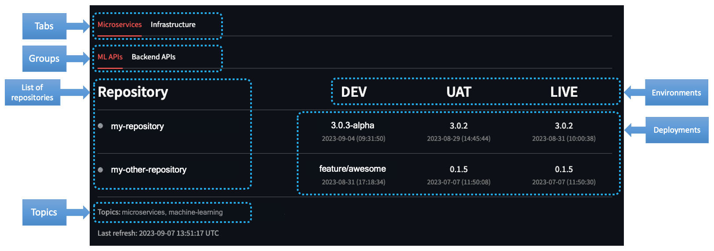

# Github Deployments Dashboard

- [About](#about)
  - [Github Deployments](#github-deployments)
- [Deployments Dashboard](#deployments-dashboard)
  - [Configuration](#configuration)
  - [Environment Variables](#environment-variables)
  - [Data Quality Check](#data-quality-check)
  - [Running the Dashboard](#running-the-dashboard)
    - [Using uv](#using-uv)
    - [Using Docker](#using-docker)
    - [Running Multiple Instances](#running-multiple-instances)

---

## About

A streamlit dashboard to visualize multiple environments deployments for a Github organization.

The dashboard was designed to run locally using [uv](https://docs.astral.sh/uv/) or [Docker](https://www.docker.com/).

### Github Deployments

Github Actions can be used to several automations in a repository. One of them are [deployments](https://docs.github.com/en/actions/deployment/about-deployments/about-continuous-deployment) to [different environments](https://docs.github.com/en/actions/deployment/targeting-different-environments/using-environments-for-deployment). The environments can have rules to define which branches can be deployed, variables and secrets for each environment, and more.

Every repository has a deployment dashboard at `https://github.com/ORG/REPO/deployments`, where all deployments for all environments are listed, and more important, **the latest one**. This dashboard is useful to see the deployments history, but it is not possible to see the deployments for all repositories in an organization.

This dashboard was created to solve this problem. It is possible to see the latest environment deployment for all repositories in an organization. The dashboard has configuration allowing to filter and group repositories, and selected which environments to show.

---

## Deployments Dashboard

The dashboard loads the selected repositories based on their [topics](https://docs.github.com/en/repositories/managing-your-repositorys-settings-and-features/customizing-your-repository/classifying-your-repository-with-topics), then get the latest deployment for each environment from the Github API. The repositories are grouped by tabs and groups, and the environments are shown in columns with the deployment tag or branch name and the datetime. In front of each repository name, there is a link to the repository using the emoji defined in the settings.



### Configuration

The dashboard settings is a JSON file with the following structure:

```json
{
    "organization": "",
    "tabs": [
        {
            "title": "",
            "groups": [
                {
                    "title": "",
                    "environments": ["", "", ""],
                    "environment_column_ratio": 0.2,
                    "topics": ["", ""]
                }
            ]
        }
    ]
}
```

**Important**: The `environment_column_ratio` is the ratio of the column width for all the environments. The number of environments times the ratio must be less than **1**, where the remaining space will be used for the repository name column.

**Note**: The `topics` are used to filter the repositories. The repositories must have all the topics to be selected and shown in the dashboard.

**Template**: [settings.template.json](settings.template.json)

**Example**:

```json
{
    "organization": "dlite-tools",
    "tabs": [
        {
            "title": "First Tab",
            "groups": [
                {
                    "title": "Group A",
                    "environments": ["EnvT", "EnvQ", "EnvP"],
                    "environment_column_ratio": 0.2,
                    "topics": ["topic-one", "topic-two"]
                },
                {
                    "title": "Group B",
                    "environments": ["Test", "Staging"],
                    "environment_column_ratio": 0.2,
                    "topics": ["topic-one", "dashboard"]
                }
            ]
        },
        {
            "title": "Second Tab",
            "groups": [
                {
                    "title": "VIP",
                    "environments": ["Production"],
                    "environment_column_ratio": 0.2,
                    "topics": ["production", "dashboard", "vip"]
                }
            ]
        }
    ]
}
```

In the settings above, the group `First Tab` will have 60% of the row width for the environments, and the remaining 40% for the repository name column. The group "Second Tab" will have 20% of the row width for the environments, and the remaining 80% for the repository name column.

### Environment Variables

| Name                         | Default         | Description |
| ---                          | ---             | ---         |
| DASHBOARD_SETTINGS_FILE      | `settings.json` | Path to the settings file |
| DASHBOARD_REPOSITORY_HEADER  | `Repository`    | Header for the list of repositories |
| DASHBOARD_REPOSITORY_EMOJI   | `gear`          | Emoji for repo link ([shortcodes](https://share.streamlit.io/streamlit/emoji-shortcodes)) |
| DASHBOARD_MAX_WORKERS        | `4`             | Workers to parallelize the request to Github API |
| DASHBOARD_PORT               | `8501`          | Port to run the dashboard |
| DASHBOARD_GITHUB_TOKEN       |                 | Github token for the requests |

You must create a `local.env` file with the environment variables to run the dashboard locally. There is a template file [template.env](template.env) with the required variables.

**Attention**: The Github token must have access repos and deployments in the organization.

**Important**: Be careful with the Github API [rate limit](https://docs.github.com/en/rest/overview/resources-in-the-rest-api?apiVersion=2022-11-28#rate-limiting). The dashboard will make a request for each repository and environment and cache this information for 60 minutes.

### Data Quality Check

The dashboard has a data quality check to validate the settings file and the Github token. When the check is executed it will create two output files:

- `final_settings.json`: This will have a copy of the settings file with the repositories selected for each group. This allows you to validate the topics selection and the number of repositories for each group.
- `final_repos.json`: This will have a list of all repositories selected for the dashboard and the latest deployment on each environment. This allows you to validate the deployment information for each repository.

To run the data quality check, you can use the command **`make check`**.

**Note**: Make sure that the uv virtual environment is installed. If it's not, you can install it with **`make install`**.

### Running the Dashboard

Before running the dashboard, you must create:

- `local.env` file with the environment variables. There is a template file [template.env](template.env) with the required variables.
- `settings.json` file with the dashboard settings. There is a template file [settings.template.json](settings.template.json) with the required structure.

#### Using uv

Make sure that the uv virtual environment is installed. If it's not, you can install it with `make install` or `uv sync --no-install-project`.

To run the dashboard, you can use the command **`make dashboard`**.

The dashboard will be available at `http://localhost:8501`.

#### Using Docker

If you don't want to install the dependencies locally and use uv, you can use Docker to run the dashboard.

You need first to build the dashboard image with the command **`make build`**.

The docker run maps the `local.env` and `settings.json` files to the container, so you can change the files locally and then run the docker container.

Then, you can run the dashboard with the command **`make run`**.

The dashboard will be available at `http://localhost:8501`.

#### Running Multiple Instances

You can run multiple instances of the dashboard with different settings files.

With uv, you need to export the environment variables and run the dashboard with the command:

```shell
export $(cat new-local.env | xargs)
uv \
    run streamlit run src/main.py \
    --server.port ${DASHBOARD_PORT} \
    --server.runOnSave true
```

With Docker, run the dashboard with the command:

```shell
export DASHBOARD_PORT=<port>
uv run --rm \
    --publish ${DASHBOARD_PORT}:${DASHBOARD_PORT} \
    --expose ${DASHBOARD_PORT} \
    --name dashboard-local-2 \
    --env-file new-local.env \
    --volume ./new-settings.json:/dashboard/settings.json \
    dashboard:local
```
